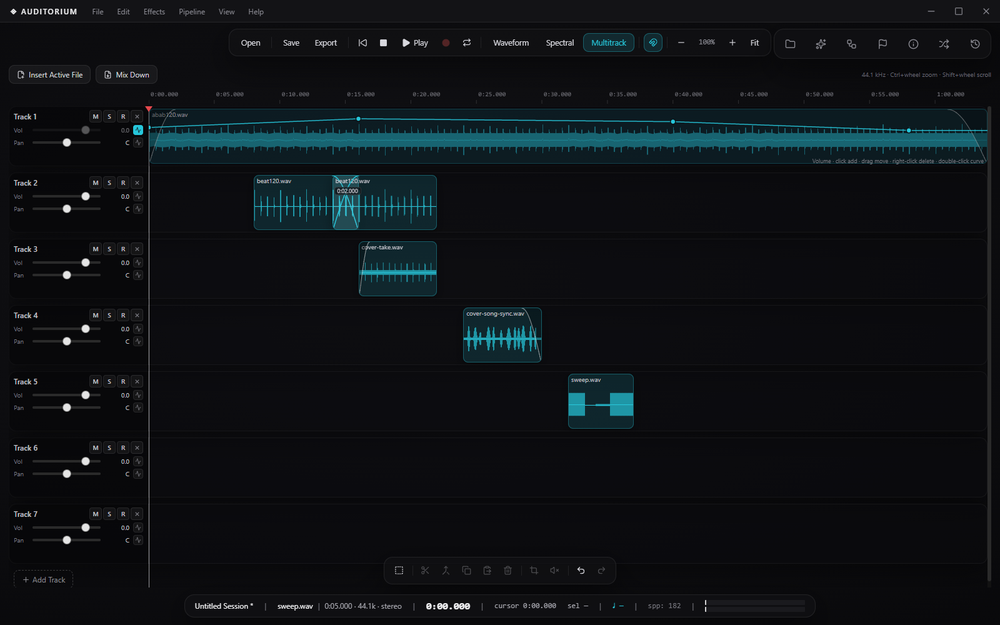
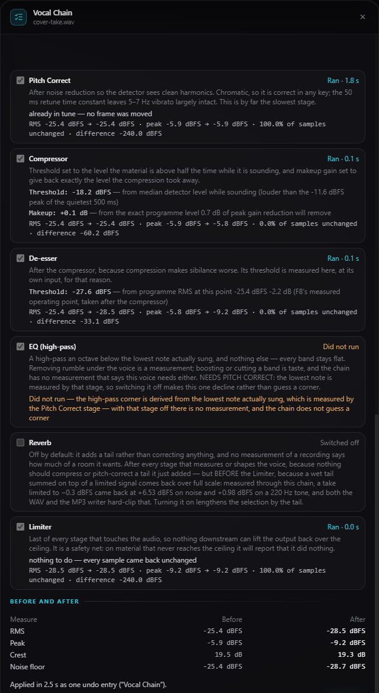
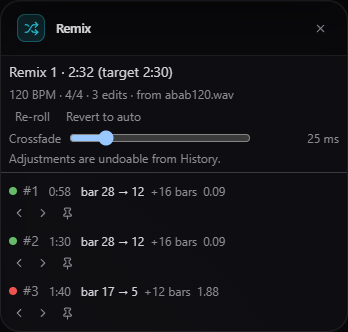
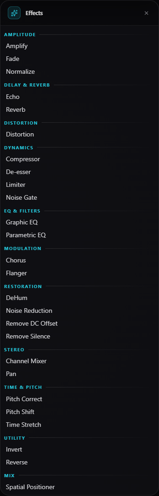
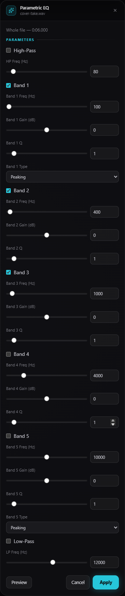
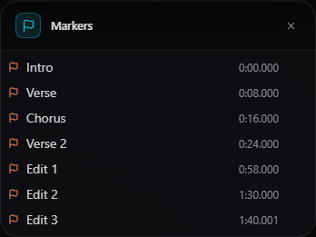
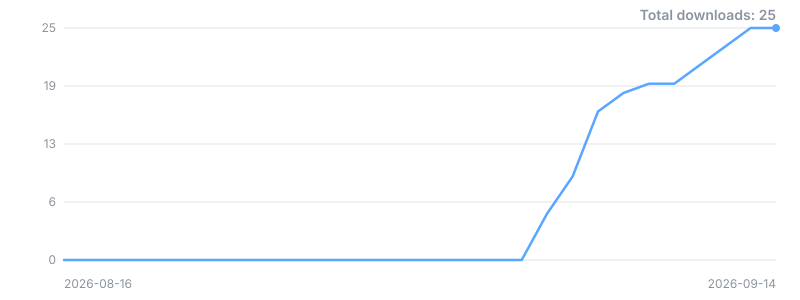

# Auditorium

[](https://github.com/Redrum624/Auditorium/releases)
[](https://github.com/Redrum624/Auditorium/releases/latest)
[](LICENSE)


> **Auditorium** — *the whole record booth, on your own machine.*

**Auditorium is a free, Audition-class audio editor for Windows.** Record a
take, clean it with a vocal chain that derives every setting from the recording
itself, split any song into stems, place your cover on the original's
instrumental, align lyrics word by word and re-sing just the one that came out
wrong — then mix it all on a multitrack timeline with automation, crossfades
and sample-accurate editing. Every stage reports what it measured, and
everything runs locally: no cloud, no account, nothing leaves the machine.

It's a no-subscription alternative to Adobe Audition with a distinct habit:
**numbers over promises**. Settings are measured, not guessed; tools that can't
measure something decline and say why; and the manual is honest about what each
feature is worth, because we measured that too.

### Why Auditorium

- **Three editors, one cursor** — destructive waveform editing, a spectral
  frequency display, and a multitrack session view with automation, clip fades,
  crossfades and group editing, sharing selection, zoom and playhead.
- **25 effects + a vocal chain that measures** — the chain runs the
  corrections a rough take needs in one pass, with every threshold derived from
  the recording itself and a report saying what each stage did or why it
  declined.
- **AI where it earns its keep, always local** — stem separation, speech
  transcription with speaker labels, a voice changer, and word-level lyric
  alignment run on your CPU in isolated processes. Models download on first
  use, sha256-pinned; Cancel kills the process outright.
- **The cover-chain journey** — give it the original song and your vocal
  take: it separates, cleans, aligns, tone-matches and builds the session
  unattended, stating its measured caveats *before* you run it.
- **Honesty as a feature** — placement accuracy, speaker-separation limits,
  voice-change quality: measured and printed in the UI and the docs. Where a
  measurement says a feature shouldn't act, it doesn't.
- **Free, MIT, no account** — download the installer and start editing.

## Install

### Download (recommended)

**Just want to use Auditorium?** Download the latest
**`Auditorium Setup X.Y.Z.exe`** from the
[**Releases**](https://github.com/Redrum624/Auditorium/releases) page and run
it — no other software required. The installer adds a desktop shortcut and a
Start Menu entry; a plain-text `README.txt` ships beside it.

**Prefer not to install anything?** Grab **`Auditorium X.Y.Z portable.exe`**
instead — a single executable that runs from anywhere (Downloads folder, USB
stick) with no installation and no admin rights, and shares the same profile —
downloaded AI models and voice profiles — as the installed app.

Neither download is code-signed yet, so Windows SmartScreen may warn the first
time — choose **More info → Run anyway**. You can verify any download first
against **`SHA256SUMS.txt`** (published with every release):

```powershell
CertUtil -hashfile "Auditorium Setup X.Y.Z.exe" SHA256   # compare with SHA256SUMS.txt
```

- **Windows 10 or 11** (64-bit)
- AI features download their models on first use (166 MB stems · ~323 MB
  transcription · 32.5 MB speaker separation · 161 MB voice · 378 MB lyric
  alignment), verified by pinned sha256 before every load.

### Build from source

Requires [Node.js](https://nodejs.org/) **20.19+ (or 22.12+)** and Git, on
Windows x64:

```bash
git clone https://github.com/Redrum624/Auditorium.git
cd auditorium
pnpm install
pnpm dev             # Vite dev server + Electron
pnpm build:win       # -> release/: Auditorium Setup <version>.exe + Auditorium <version> portable.exe
                     #    (+ README.txt and SHA256SUMS.txt covering all three)
```

## A closer look

**The spectral frequency display** — a log-axis spectrogram rendered off the
main thread, sharing the waveform's cursor, selection and playhead.


**The multitrack editor** — clips with fades and a crossfade across the
tracks, and a volume envelope open on the top lane, all at the same cursor
the other two editors share.



**The pipeline tools open beside the waveform, not over it.** A multi-stage
pass — Cover Chain, Vocal Chain, transcription — steps through its stages in
the module column while you keep selecting audio and moving the playhead. Every
stage row carries the note saying why it sits where it sits, and afterwards,
what it measured.

| | |
|:--:|:--:|
|  |  |
| **Vocal Chain, after a run** — each stage reports the settings it derived, its measured delta, or the measurement that made it decline; the pass closes with a before/after table and lands as one undo entry. | **Cover Chain, before you run it** — the measured caveats are stated before anything runs, and every stage of the six-stage journey is written out on the card. |
|  |  |
| **Align Lyrics** — paste the words you know are in the recording; click a word to hear exactly it, and re-record just the one that came out wrong. | **The Remix panel** — every splice of a re-arrangement, inspectable, pinnable, re-rollable and undoable. |

**The effects, from rack to card.** Every registered effect lives in a
categorized rack one click from the waveform; one click opens it as a card in
the module column, and every card previews against the real document before
Apply.

| | |
|:--:|:--:|
|  |  |
| **The Effects rack** — 25 effects in ten categories; the Pipeline tools have their own module. | **Parametric EQ** — five bands plus high- and low-pass, previewed on the real audio before Apply. |
|  |  |
| **Reverb** — room size, damping, mix and pre-delay; Preview plays the processed document, Apply is one undo entry. | **The Spatial positioner** — azimuth, elevation and distance as honest stereo projection, writing automation keys on release. |

**The side panels** — the module column's cards, always the same width, never
over the audio.

| | |
|:--:|:--:|
|  |  |
| **Properties** — the selected clip's geometry and gain, with both fade editors and the crossfade's own controls. | **Markers** — named positions that persist sample-accurately in every container and survive destructive edits. |

## Modules

- **Waveform Editor** — per-sample amplitude view with zoom, scroll, selection, cursor and playhead.
- **Spectral Frequency Display** — off-main-thread spectrogram, log or linear axis, HiDPI-rendered.
- **Multitrack Editor** — tracks and clips with volume/pan/mute/solo/arm, non-destructive fades and crossfades, rubber-band multi-select (press-and-drag a lane's background) with cross-track group drag, a marked **current track** (set on press — any clip, lane background, or header outside its own controls, including the press that starts a marquee drag — where the next paste lands), clip **copy/paste** (`Ctrl+C`/`Ctrl+V`, landing to the right of the bar on the current track), a **time selection** (`Shift`+drag a lane) with Trim and Silence acting on it, ripple delete, join selected clips into one (silence in the gaps), **selectable gaps** (double-click the empty stretch between two clips and `Del` closes it, moving only that track's later clips), per-track automation envelopes, and one-step-per-gesture session undo.
- **Spatial Panel** — places a track's sound around the listener (azimuth/elevation/distance, honest stereo projection — not binaural), writing automation keys on release.
- **Recorder** — input-device selection, channel/rate choice, live level meter; multitrack punch-in on armed tracks.
- **Effects Rack** — categorized effects, each opening on one click as a card in the module column; the Pipeline tools have their own module.
- **Pipeline Module & Menu** — the twelve long-running tools in three groups (Tempo & Timing, Voice, Analysis); each opens as a wide card in the module column.
- **Files / History / Markers / Properties Panels** — open documents, browsable undo history, the marker list, and read-only facts about the active document or clip.
- **Module Strip** — the icon strip over the module column; the bar and the open module are always the same width.
- **Edit Toolbar** — a ten-button floating pill: Select All, Split, Join, Copy, Paste, Delete, Trim, Silence, Undo, Redo, greyed by the same rules as the menu. Bare-letter accelerators sit beside every existing Ctrl combo (`A`/`C`/`J`/`D`/`T`/`S`/`U`/`R`); Join Clips (renamed from Merge Clips, `J`) lights only in the Multitrack view; Cut keeps `Ctrl+X` in the Edit menu with no bare letter of its own.
- **Transport & Level Meters** — play/stop/record/loop, view toggle, zoom cluster, time readout and output meters, centred on the waveform rather than the window. **Play starts at the position line**, always — Pause moves the line to where playback stopped, so `Space`·`Space` still resumes; the one exception is a selection the line sits outside, which plays from the selection's start.
- **Tempo Readout & Beat Grid** — detected BPM with confidence everywhere it matters, and the tracked beats drawn under all three editors (dimmed and dashed when stale rather than presented as fact).
- **Match Tempo Tool** — one ratio or a per-beat tempo map from the confirmed grid; measured on accelerandi: worst interior beat 526 ms → 4.6 ms at 0.83 BPM/s drift.
- **Align Vocal Timing Tool** — warps syllables onto the grid between anchors you confirm; defaults to 25 % strength because a fully quantised vocal sounds machine-made.
- **Align Lyrics Tool** — places every word of known lyrics against the recording (median 20 ms word-start accuracy, measured); click a word to hear it, re-record just that word, and it splices in level- and pitch-matched, length-preserved.
- **Vocal Chain Tool** — eleven correction stages in a measured order, each reporting its derived settings, its delta, or the measurement that made it decline. The noise gate decides *where*, not how loud — see Features.
- **Cover Chain Tool** — the six-stage journey from original song + your take to a finished two-track session, with the caveats stated above the Run button.
- **Podcast Chain Tool** — ten speech-tuned stages ending in a delivery target: DC removal, noise reduction, de-hum, shortened pauses, gate, compression, de-essing, EQ, **loudness to −16 LUFS (stereo) or −19 LUFS (mono)** by ITU-R BS.1770-4, and a limiter at −1.0 dBFS **sample peak**. One undo entry; documents with more than two channels are refused rather than mis-measured.
- **Auto-Remix Tool & Remix Panel** — re-arranges a track's own bars to a target length; every splice inspectable, rejectable, pinnable (up to four pins guaranteed to survive every re-plan) and undoable.
- **Separate Voice Tool** — the same separation landed as two tracks instead of five: `— Voice` and `— Backing` (drums + bass + everything else + residual). The two add back up to the source **within float32 rounding** (measured worst error 4.32e-7) — the five-stem landing is the bit-exact one. When more than one person is talking it goes one step further and lands **one track per speaker** plus Backing: it counts the voices, shows you the count with each speaker's speech time before anything lands, and lets you overrule it. On the four test recordings (three with two speakers, one with four) the count was right every time, both from clean speech and through the separation the tool runs first — measured in [`docs/bench/diarize-bench-baseline.json`](docs/bench/diarize-bench-baseline.json). Speaker tracks carry short fades at each turn and share any overlap, so they do **not** add back sample for sample; Backing still does.
- **Separate into Stems Tool** — Drums/Bass/Vocals/Other + Residual as five documents and a session that sums back to the source **bit-exactly** (measured: worst error 0).
- **Transcribe Tool & Transcript Panel** — timestamped speech-to-text with speaker labels, coloured timeline regions, instant speaker-count regrouping, SRT/WebVTT export.
- **Voice Changer Tool** — re-timbres a recording toward a saved voice profile; requires an explicit rights affirmation before any reference clip is used.

## Features

**Editing & formats**

- Sample-accurate copy/paste/trim/silence, a Delete and a `Ctrl+X` cut that keep the length (the span is zero-filled, markers stay put; `Shift+Del` ripples), and **Split at Cursor** (`Ctrl+K`): every marker is a segment boundary and a double-click selects the segment under the pointer — with per-document undo (50 steps / 800 MB budget) and full session undo in the multitrack, where Split cuts every clip under the cursor on the selected tracks in one step. **Join Clips** (`J`, renamed from Merge Clips) is Split's inverse there: on every track with two or more clips selected they become one clip spanning from the first start to the last end, silence in the gaps, over a new `Join N` file that has the members' gain and fades rendered into it — one undo step for the whole gesture, Multitrack only.
- Open WAV, MP3, FLAC and OGG (Opus) with native-rate import across container variants (including surround WAV with selectable ITU-R downmix); **Save writes the project** (`.audm`, atomic) in every view and never overwrites an audio file — audio leaves through Export.
- Export WAV 16/24/32-float, FLAC, MP3 CBR, OGG Opus — the active document in the editors, the session mixdown (muted tracks out, automation and fades in) in the multitrack.
- Markers persist sample-accurately in every container (WAV cue, ID3 chapters, FLAC/OGG chapter tags) and survive destructive edits by remapping.
- Snapping ("the magnet"): cursor, selections, clip drags and trims quantise to clip edges, beats, markers and the session cursor — placed geometry outranks derived; Alt suspends.
- The draggable red cursor handle rides all three views, snap-aware, transport-neutral.
- **Zoom anchors on the position line**, on every path and both surfaces — `Ctrl`+wheel and the toolbar's `−`/`+` alike, in the waveform, spectral and multitrack views. The line keeps its place on screen; when it is off screen the new view is centred on it. `Shift`+wheel scrolls and **Fit** are unchanged.
- Projects save as `.audm` (binary v4, v3 still opens) carrying every open document plus the session's clips, fades, crossfades, automation and spatial lanes; Mix Down renders bit-identically to live playback.

**The vocal chain, in one paragraph**

Eleven stages in a measured order — DC offset, noise reduction, de-hum, optional
silence removal, the gate, pitch correction, compression, de-essing, high-pass,
limiting, optional reverb. Every setting is derived from the take: the
compressor's threshold is the level the take exceeds half the time it is
sounding, the noise print is learned from the quietest half-second of *real*
material (never digital silence), the high-pass sits an octave under the lowest
sung note. **The gate asks WHERE, not how loud**: aligned lyrics or a transcript
protect word spans absolutely; every half-second is measured for vocal-tract
resonance so whispers, breaths and held consonants survive; anything voiced is
kept — and pause noise *louder than your softest singing* still goes, which no
level threshold could ever do. When nothing qualifies it declines with the
numbers and offers the manual threshold instead. Measured end to end on a real
142-second take: noise floor −61.3 → −67.4 dBFS, median pitch deviation
23.3 → 14.7 cents, programme level within 0.2 dB, length unchanged.

**The cover chain, honestly**

Separation's five stems sum back to the mix exactly, so the instrumental is
the original minus its vocal to the last bit — but it still *contains* the
original singer (measured 17.95 dB below the music), and the tool says so
before you run it. Alignment is a placement, not a warp — cross-correlated
against the separated vocal (deliberately not the song: refining against the
mix was built, measured costing 3.3–12.9 ms, and withdrawn), recovered to
within 10 ms at normal levels, and when the evidence is weak it still places
the tracks at the measured lag with every rival lag one click away. Matching
is EQ, loudness and a limiter measured against the separated original vocal;
Match Reverb usually *declines*, having measured that the app's shortest decay
exceeds what the record shows. The level trim after mixdown takes back its own
overshoot on both faders equally — one undo entry.

**Analysis & AI, with the measurements attached**

- **Tempo detection** — tracked beats (not extrapolated), confidence reported, ×2/÷2 octave re-track.
- **Stem separation** — bit-exact recombination guaranteed; separation quality bounded by the model, and the UI says so. CPU at ~1.5× realtime.
- **Speaker separation** (Separate Voice) — the right count on 4 of 4 test recordings, in both conditions measured (clean speech and through the stem separation the tool runs first); ~162 s of material, count-only truth, no diarization error rate, near-zero overlap in it — the tool prints that limit beside the count and hands you the control.
- **Transcription** — 100 % speaker accuracy on clean two-voice material, 45–73 % at three voices, overlap not detected: printed in the tool, and the speaker count is a control you can change instantly.
- **Voice changer** — measured mean cosine 0.795 toward the target (vs 0.615 source) across five real voices; a change, not a forensic clone, and the tool says which.
- **Lyric alignment** — median 20 ms word starts, 88 % within 100 ms on sung material; a mismatch between lyrics and audio raises a warning, never a refusal.
- A per-phone pronunciation scorer was built, measured at AUC 0.642, **and cut** — your ear picks the word; the tool makes it reachable.

**Quality of life**

- A launch splash that reports the stages startup genuinely reached (measured: zero added latency).
- A crash card that names the error selectably instead of a frozen window; background failures raise a dismissible notice that blocks nothing.
- Keyboard shortcuts throughout — the full table in [`KEYBOARD_SHORTCUTS.md`](KEYBOARD_SHORTCUTS.md).

## Architecture

- **Desktop**: Electron 43 — `contextIsolation`, `sandbox`, `nodeIntegration: false`, typed IPC whitelist, fail-closed write-path policy; the renderer never touches the filesystem.
- **Frontend**: React 19 + TypeScript (strict) + Vite 7 + Zustand; waveform, spectrogram and multitrack draw to canvas.
- **DSP**: pure synchronous TypeScript — every effect is a `process()` over `Float32Array` channels; heavy work runs in Web Workers.
- **Inference**: `onnxruntime-node` (CPU) inside one Electron `utilityProcess` per feature — killable on Cancel, never loaded by the renderer. No GPU path: measured, DirectML exhausted 15.7 of 16 GB VRAM without finishing one segment, while the CPU runs stems at ~1.5× and transcription at ~9× realtime.

```
vocalChain.ts        // the measured eleven-stage chain + its report
coverJourney.ts      // the six-stage cover pipeline
stemPartition.ts     // ratio masks + time-domain residual = exact recombination
MultitrackPlayer.ts  // live engine, scheduled against one clock epoch
mixdown.ts           // the offline ground truth the live engine must match
alignLyricsService   // CTC forced alignment + the word-splice
```

## Development

```bash
pnpm dev             # dev server + Electron
pnpm test            # jest — 3 projects, 6000+ tests
pnpm typecheck       # tsc --noEmit
pnpm smoke           # packaged end-to-end smoke (800+ assertions)
pnpm navigate        # packaged UI walker (50 surfaces)
```

## Documentation

- **[docs/USER_GUIDE.md](docs/USER_GUIDE.md)** — the full walkthrough
- **[docs/KNOWN_LIMITATIONS.md](docs/KNOWN_LIMITATIONS.md)** — where Auditorium deliberately differs from Audition, with the measurements
- **[KEYBOARD_SHORTCUTS.md](KEYBOARD_SHORTCUTS.md)** — every binding
- **[CHANGELOG.md](CHANGELOG.md)** — release notes, root causes included
- **[docs/bench/README.md](docs/bench/README.md)** — the measurement discipline behind the numbers
- **[THIRD_PARTY_NOTICES.md](THIRD_PARTY_NOTICES.md)** — every bundled component, model and ported algorithm

## Contributing

Issues and PRs welcome — see [CONTRIBUTING.md](CONTRIBUTING.md). The short
version: open an issue first, one logical change per PR, keep `pnpm test` and
`pnpm typecheck` green, and behavior changes carry tests that failed before
the change.

## Credits

- **Stem separation** — **HT-Demucs** by **Meta AI** (MIT), via the
  [`StemSplitio/htdemucs-onnx`](https://huggingface.co/StemSplitio/htdemucs-onnx) export (MIT).
- **Speech recognition** — **Whisper base** by **OpenAI** (Apache-2.0), via
  [`onnx-community/whisper-base`](https://huggingface.co/onnx-community/whisper-base).
- **Speaker embeddings** — **CAM++** by the **WeSpeaker** project (Apache-2.0), from the
  [sherpa-onnx model release](https://github.com/k2-fsa/sherpa-onnx/releases/tag/speaker-recongition-models).
- **Speaker segmentation** (Separate Voice) — **pyannote-segmentation-3.0** by **Hervé
  Bredin / CNRS** (MIT), via the ONNX conversion in
  [`csukuangfj/sherpa-onnx-pyannote-segmentation-3-0`](https://huggingface.co/csukuangfj/sherpa-onnx-pyannote-segmentation-3-0)
  — the upstream HuggingFace repository is gated; this mirror is not.
- **Speaker embeddings for Separate Voice** — **WeSpeaker ResNet34-LM** (VoxCeleb,
  Apache-2.0), from the same
  [sherpa-onnx model release](https://github.com/k2-fsa/sherpa-onnx/releases/tag/speaker-recongition-models).
- **Voice conversion** — **OpenVoice V2** by **MyShell.ai** (MIT), via
  [`Hinotsuba/OpenVoice-ONNX-v2`](https://huggingface.co/Hinotsuba/OpenVoice-ONNX-v2) (MIT).
- **Forced alignment** — **wav2vec2-base-960h** by **Meta AI** (Apache-2.0 upstream); the ONNX
  graph rides the [`onnx-community` mirror](https://huggingface.co/onnx-community/wav2vec2-base-960h-ONNX),
  which declares no licence of its own — the derivation is stated rather than glossed, and the
  sha256 pins are load-bearing.
- **MP3 encoding** — [**lamejs**](https://www.npmjs.com/package/@breezystack/lamejs) (LGPL-3.0),
  statically bundled — full licence text and relink note in
  [`THIRD_PARTY_NOTICES.md`](THIRD_PARTY_NOTICES.md).

Every model is downloaded from its source on first use — nothing is rehosted,
nothing is bundled.

## Downloads



<sub>Sampled daily from the GitHub Releases API — the curve builds from launch
day forward.</sub>

## License

[PolyForm Noncommercial 1.0.0](LICENSE) © 2026 Redrum624 — free for any noncommercial
purpose; commercial use requires a separate licence.

---

**Auditorium** — a free, Audition-class audio editor for Windows.
